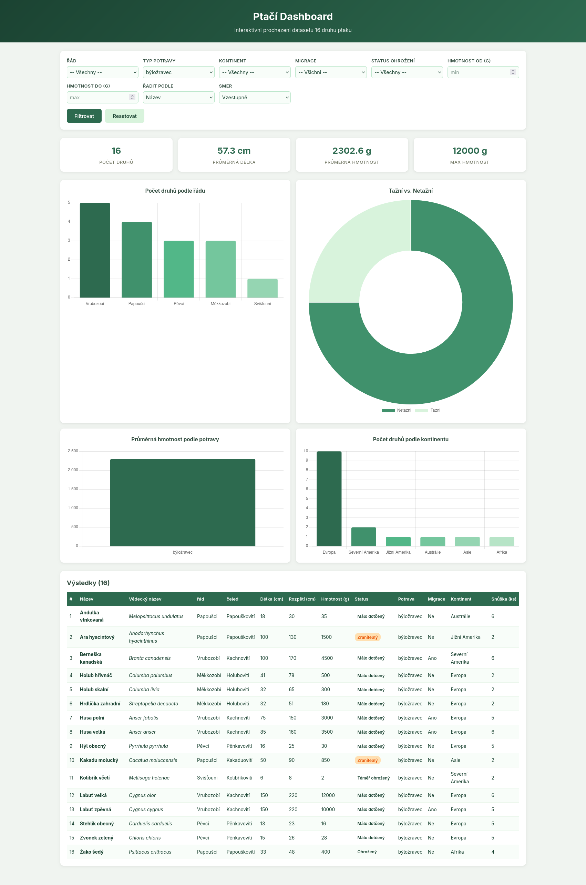

# Ptačí Dashboard

Cílem projektu je vytvořit interaktivní webovou aplikaci pro procházení datasetu ptáků. Aplikace bude postavena na frameworku Flask (Python), data budou uložena v SQLite databázi a na stránce se budou zobrazovat tabulky i grafy. Zároveň si procvičíte základní práci s Gitem — po každém úkolu provedete commit.

## Popis datasetu

Soubor [dataset_ptaci_final.csv obsahuje](./assets/birds/dataset_ptaci_final.csv) 120 druhů ptáků s těmito sloupci:

| Sloupec | Popis | Typ |
|---|---|---|
| `nazev` | Český název ptáka | text |
| `vedecky_nazev` | Latinský název | text |
| `rad` | Biologický řád | text |
| `celed` | Biologická čeleď | text |
| `delka_cm` | Průměrná délka těla v cm | celé číslo |
| `rozpeti_cm` | Průměrné rozpětí křídel v cm | celé číslo |
| `hmotnost_g` | Průměrná hmotnost v gramech | celé číslo |
| `status_ohrozeni` | Stupeň ohrožení (Málo dotčený, Téměř ohrožený, Zranitelný, Ohrožený) | text |
| `typ_potravy` | Kategorie stravy (všežravec, masožravec, hmyzožravec, býložravec, mrchožrout) | text |
| `migrace` | Tažný pták (1 = ano, 0 = ne) | celé číslo |
| `vyskyt_kontinent` | Hlavní kontinent výskytu | text |
| `snuska_ks` | Průměrný počet vajec ve snůšce | desetinné číslo |

---

## Úkol 1 — Založení repozitáře a kostra projektu

### Co udělat
1. Ve složce projektu inicializujte Git repozitář (`git init`).
2. Vytvořte soubor `.gitignore` s tímto obsahem:
   ```
   __pycache__/
   *.pyc
   ptaci.db
   .venv/
   ```
3. Vytvořte adresářovou strukturu projektu:
   ```
   birds/
   ├── templates/
   ├── static/
   ├── dataset_ptaci_final.csv
   └── .gitignore
   ```
4. Vytvořte soubor `app.py` s minimální Flask aplikací — stačí jeden route `/`, který vrátí text `"Ptačí Dashboard"`.
   ```python
   from flask import Flask

   app = Flask(__name__)

   @app.route("/")
   def dashboard():
       return "Ptačí Dashboard"

   if __name__ == "__main__":
       app.run(debug=True)
   ```
5. Ověřte, že aplikace běží — spusťte `python app.py` a v prohlížeči otevřete `http://127.0.0.1:5000`.

### Commit
```
git add .
git commit -m "Založení projektu — Flask kostra a struktura adresářů"
```

---

## Úkol 2 — Import CSV do SQLite databáze

### Co udělat
1. Vytvořte skript `import_csv.py`, který:
   - Načte soubor `dataset_ptaci_final.csv` pomocí modulu `csv` (třída `csv.DictReader`).
   - Vytvoří SQLite databázi `ptaci.db` s tabulkou `ptaci`.
   - Vloží do ní všechny záznamy z CSV.

2. Tabulka `ptaci` má mít tyto sloupce:
   ```sql
   CREATE TABLE ptaci (
       id INTEGER PRIMARY KEY AUTOINCREMENT,
       nazev TEXT,
       vedecky_nazev TEXT,
       rad TEXT,
       celed TEXT,
       delka_cm INTEGER,
       rozpeti_cm INTEGER,
       hmotnost_g INTEGER,
       status_ohrozeni TEXT,
       typ_potravy TEXT,
       migrace INTEGER,
       vyskyt_kontinent TEXT,
       snuska_ks REAL
   );
   ```

3. Při čtení CSV použijte kódování `utf-8-sig` (soubor obsahuje BOM).

4. Na konci skript vypíše počet importovaných záznamů pro kontrolu.

5. Spusťte `python import_csv.py` a ověřte, že se vytvoří `ptaci.db` se 120 záznamy.

### Nápověda
- `sqlite3.connect("ptaci.db")` — připojení k databázi
- `csv.DictReader(f)` — čtení CSV po slovnících (klíče = hlavička)
- Při vkládání dat do SQL vždy používejte parametrizované dotazy s `?` (nikdy neskládejte SQL řetězce ručně).
- `int()` a `float()` pro přetypování číselných hodnot z CSV (CSV čte vše jako řetězce).

### Commit
```
git add import_csv.py
git commit -m "Import skript — načtení CSV dat do SQLite databáze"
```

---

## Úkol 3 — Napojení Flask aplikace na databázi a výpis tabulky

### Co udělat
1. V `app.py` přidejte:
   - Import modulů `sqlite3` a `os`.
   - Pomocnou funkci `get_db()`, která otevře spojení na `ptaci.db` a nastaví `row_factory = sqlite3.Row` (umožní přistupovat ke sloupcům podle názvu).
   - V route `/` načtěte všechny ptáky z databáze (`SELECT * FROM ptaci ORDER BY nazev ASC`) a předejte je do šablony.

2. Vytvořte soubor `templates/dashboard.html` — Jinja2 šablonu, která:
   - Obsahuje základní HTML kostru (`<!DOCTYPE html>`, `<head>`, `<body>`).
   - Zobrazí nadpis stránky.
   - Vykreslí HTML tabulku (`<table>`) se všemi ptáky a sloupci: #, Název, Vědecký název, Řád, Čeleď, Délka, Rozpětí, Hmotnost, Status, Potrava, Migrace, Kontinent, Snůška.
   - Pro migrace zobrazí „Ano"/„Ne" místo 1/0.

### Nápověda
- `render_template("dashboard.html", ptaci=ptaci)` — předání dat do šablony.
- V šabloně použijte `` pro iteraci a `{{ p['nazev'] }}` pro výpis hodnot.
- `{{ loop.index }}` — pořadové číslo v cyklu Jinja2.

### Commit
```
git add app.py templates/dashboard.html
git commit -m "Napojení na databázi — výpis všech ptáků v HTML tabulce"
```

---

## Úkol 4 — Filtry přes GET parametry

### Co udělat
1. V `app.py` přidejte zpracování GET parametrů z `request.args`:
   - `rad` — filtr podle řádu
   - `typ_potravy` — filtr podle typu potravy
   - `kontinent` — filtr podle kontinentu
   - `migrace` — filtr tažný (1) / netažný (0)
   - `status` — filtr podle statusu ohrožení
   - `hmotnost_min`, `hmotnost_max` — rozsah hmotnosti

2. Napište funkci `build_query(params)`, která ze zadaných parametrů sestaví `WHERE` klauzuli a seznam hodnot. Každou podmínku přidávejte jen pokud je parametr vyplněn. Podmínky spojte operátorem `AND`.

3. Napište funkci `get_filter_options(conn)`, která z databáze načte unikátní hodnoty pro dropdowny (příkaz `SELECT DISTINCT ... ORDER BY ...` pro sloupce `rad`, `celed`, `typ_potravy`, `vyskyt_kontinent`, `status_ohrozeni`).

4. V šabloně přidejte formulář (`<form method="GET" action="/">`) s ovládacími prvky:
   - `<select>` pro každý textový filtr — naplněný hodnotami z `filter_options`.
   - `<input type="number">` pro hmotnost min/max.
   - Tlačítko „Filtrovat" (`<button type="submit">`).
   - Odkaz „Resetovat" (`<a href="/">`).

5. Zajistěte, aby po odeslání formuláře zůstaly vybrané hodnoty zachované (atribut `selected` u `<option>`, atribut `value` u `<input>`).

### Nápověda
- `request.args.get("rad")` — získání GET parametru.
- Pro zachování vybraného filtru v selectu: `{{ 'selected' if params.get('rad') == r }}`.
- Bezpečnost: používejte vždy parametrizované dotazy (`?`), nikdy nevkládejte hodnoty přímo do SQL řetězce.

### Commit
```
git add app.py templates/dashboard.html
git commit -m "Filtry — ovládací prvky pro filtrování ptáků přes GET parametry"
```

---

## Úkol 5 — Řazení výsledků

### Co udělat
1. Přidejte dva GET parametry: `razeni` (sloupec) a `smer` (`ASC`/`DESC`).

2. V `app.py` definujte množinu povolených sloupců pro řazení:
   ```python
   ALLOWED_SORT_COLUMNS = {
       "nazev", "vedecky_nazev", "rad", "celed",
       "delka_cm", "rozpeti_cm", "hmotnost_g",
       "status_ohrozeni", "typ_potravy", "migrace",
       "vyskyt_kontinent", "snuska_ks",
   }
   ```
   Pokud uživatel pošle název sloupce, který v množině není, použijte výchozí `"nazev"`. Tím zabráníte SQL injection přes název sloupce.

3. Pro směr řazení povolte pouze hodnoty `"ASC"` a `"DESC"` — cokoli jiného nahraďte za `"ASC"`.

4. Přidejte do SQL dotazu `ORDER BY {razeni} {smer}`.

5. Do formuláře v šabloně přidejte dva nové selecty:
   - „Řadit podle" — s volbami Název, Řád, Délka, Rozpětí, Hmotnost, Snůška.
   - „Směr" — Vzestupně (ASC) / Sestupně (DESC).

### Commit
```
git add app.py templates/dashboard.html
git commit -m "Řazení — volba sloupce a směru řazení výsledků"
```

---

## Úkol 6 — Statistické karty

### Co udělat
1. V `app.py` přidejte agregační dotaz nad filtrovanými daty:
   ```sql
   SELECT
       COUNT(*) as pocet,
       ROUND(AVG(delka_cm), 1) as prum_delka,
       MAX(hmotnost_g) as max_hmotnost,
       MIN(hmotnost_g) as min_hmotnost,
       ROUND(AVG(hmotnost_g), 1) as prum_hmotnost,
       ROUND(AVG(rozpeti_cm), 1) as prum_rozpeti
   FROM ptaci {where}
   ```
   Předejte výsledek do šablony jako proměnnou `stats`.

2. V šabloně přidejte nad tabulku sekci se 4 kartami, každá zobrazí jednu statistiku:
   - Počet druhů (`stats['pocet']`)
   - Průměrná délka (`stats['prum_delka']` cm)
   - Průměrná hmotnost (`stats['prum_hmotnost']` g)
   - Maximální hmotnost (`stats['max_hmotnost']` g)

3. Karty zobrazte v řadě vedle sebe (můžete zatím použít inline styly nebo jednoduchý flex/grid).

### Commit
```
git add app.py templates/dashboard.html
git commit -m "Statistiky — souhrnné karty s agregovanými údaji"
```

---

## Úkol 7 — Grafy pomocí Chart.js

### Co udělat
1. Do hlavičky šablony vložte odkaz na knihovnu Chart.js z CDN:
   ```html
   <script src="https://cdn.jsdelivr.net/npm/chart.js@4.4.7/dist/chart.umd.min.js"></script>
   ```

2. V `app.py` přidejte 4 agregační dotazy (s GROUP BY), které vrátí data pro grafy. Všechny dotazy musí respektovat aktuální filtry (používejte stejnou `WHERE` klauzuli):
   - **Počet druhů podle řádu**: `SELECT rad, COUNT(*) as pocet FROM ptaci {where} GROUP BY rad ORDER BY pocet DESC`
   - **Průměrná hmotnost podle typu potravy**: `SELECT typ_potravy, ROUND(AVG(hmotnost_g), 0) as prum FROM ptaci {where} GROUP BY typ_potravy ORDER BY prum DESC`
   - **Tažní vs. netažní**: `SELECT migrace, COUNT(*) as pocet FROM ptaci {where} GROUP BY migrace`
   - **Počet druhů podle kontinentu**: `SELECT vyskyt_kontinent, COUNT(*) as pocet FROM ptaci {where} GROUP BY vyskyt_kontinent ORDER BY pocet DESC`

3. Data pro grafy předejte do šablony jako dvojice seznamů (popisky + hodnoty), např.:
   ```python
   graf_rad_labels = [r["rad"] for r in druhy_rad]
   graf_rad_data = [r["pocet"] for r in druhy_rad]
   ```

4. V šabloně vytvořte 4 elementy `<canvas>` (každý s unikátním `id`) a ve `<script>` bloku na konci stránky inicializujte 4 grafy:
   - **Druhy podle řádu** — sloupcový graf (`type: 'bar'`)
   - **Tažní vs. netažní** — prstencový graf (`type: 'doughnut'`)
   - **Hmotnost podle potravy** — sloupcový graf (`type: 'bar'`)
   - **Druhy podle kontinentu** — sloupcový graf (`type: 'bar'`)

5. Pro předání dat z Pythonu do JavaScriptu použijte Jinja2 filtr `tojson`:
   ```javascript
   labels: {{ graf_rad_labels|tojson }},
   data: {{ graf_rad_data|tojson }},
   ```

### Nápověda — příklad inicializace grafu
```javascript
new Chart(document.getElementById('chartRad'), {
    type: 'bar',
    data: {
        labels: {{ graf_rad_labels|tojson }},
        datasets: [{
            label: 'Počet druhů',
            data: {{ graf_rad_data|tojson }},
            backgroundColor: '#2d6a4f',
            borderRadius: 4,
        }]
    },
    options: {
        responsive: true,
        plugins: { legend: { display: false } },
        scales: {
            y: { beginAtZero: true, ticks: { stepSize: 1 } }
        }
    }
});
```

### Commit
```
git add app.py templates/dashboard.html
git commit -m "Grafy — 4 interaktivní grafy pomocí Chart.js"
```

---

## Úkol 8 — Stylování pomocí CSS

### Co udělat
1. Vytvořte soubor `static/style.css` a v šabloně jej nalinkujte:
   ```html
   <link rel="stylesheet" href="{{ url_for('static', filename='style.css') }}">
   ```

2. Nastylujte tyto části stránky:
   - **Header** — tmavě zelený gradient (`#1b4332` → `#2d6a4f`), bílý text, centrovaný.
   - **Filtry** — bílá karta se stínem, inputy a selecty v CSS Gridu (`grid-template-columns: repeat(auto-fill, minmax(180px, 1fr))`), tlačítka se zeleným pozadím.
   - **Statistické karty** — v řadě vedle sebe (CSS Grid), centrovaný text, velké číslo nahoře, popisek pod ním.
   - **Grafy** — mřížka 2×2 (`grid-template-columns: repeat(2, 1fr)`), každý graf v bílé kartě.
   - **Tabulka** — zelená hlavička, zebra striping (sudé řádky světlejší), zvýraznění řádku při hoveru, scrollovatelná horizontálně (`overflow-x: auto`).
   - **Badges pro status ohrožení** — barevné štítky: „Málo dotčený" zelená, „Téměř ohrožený" žlutá, „Zranitelný" oranžová, „Ohrožený" červená.

3. Přidejte responzivitu:
   - Pod 768px: grafy v jednom sloupci, filtry ve dvou sloupcích.
   - Pod 480px: filtry v jednom sloupci.

### Commit
```
git add static/style.css templates/dashboard.html
git commit -m "Stylování — CSS layout, karty, barvy a responzivita"
```


# Demo



