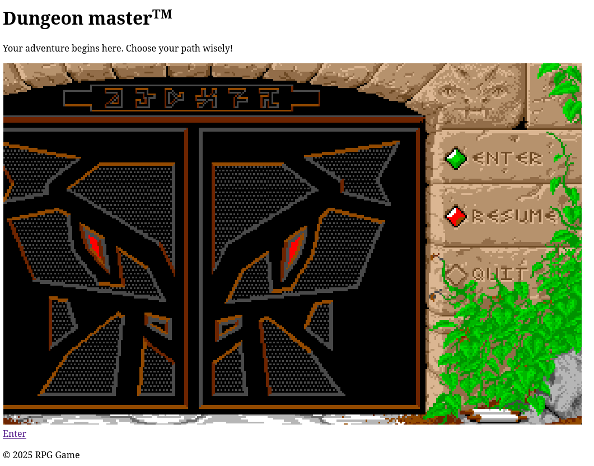
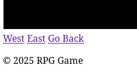
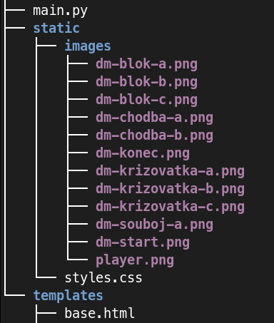

# Samostatná práce - RGB

*odhadovaný čas: ~60 min. + přečtení zadání*

Vytvoříte aplikaci postavenou na frameworku [Flask](https://flask.palletsprojects.com/).

Aplikace formou webových stránek navodí atmosféru hry na motivy krokovacích dungeonů. Pro inspiraci se podívejte na https://rpg.asgard.odbornaskola.cz/.

## Disclaimer

Tato práce je zaměřená na použivání odkazů (*routing*) a HTML šablon (*jinja templates*) ve frameworku Flask.

Součástí hodnocení proto není vzhled.

Pokud zadání zmiňuje použití nadpisu, odkazu, obrázku nebo odstavce ... myslí se tím použití výchozích HTML elementů jako `h1-h6`, `a`, `img` nebo `p`.

### Není součástí hodnocení
- Použití nebo nepoužití frameworku [Bootstrap](https://getbootstrap.com/).
- Obecně vzhled nebo rozvržení (layout). 
- Stránka je rozdělená pomocí grid systému na dva sloupce v poměru 8:4. Toto není nutné dodržet, není to součástí hodnocení. Výsledek může vypadat např. takto: 

[](./assets/rpg/docs/bez-css-1.png).
  - V předloze jsou odkazy stylované pomocí CSS komponent z frameworku Bootstrap. Pro splnění zadání stačí použití odkazů (`<a href=...`) bez nutnosti na ně aplikovat stylopisy. Tedy výstup může vypadat např. takto: 

[](./assets/rpg/docs/bez-css-2.png).

- Minimapa.
- Odkaz pro možnost jít zpět (*Go Back*).

## Požadavky na implementaci

- Založte pro aplikaci repozitář na serveru Github, kam umístíte zdrojové kódy.
- Výchozí stránka (`/`) bude obsahově stejná jako v odkazované [předloze](https://rpg.asgard.odbornaskola.cz/), tzn. nadpis, obrázek, odkaz a ostatní texty. Odkazem se uživatel dostane na první pole dungeonu.
- Pro vytváření HTML stránek využijte koncept [dědičnosti šablon](https://jinja.palletsprojects.com/en/stable/templates/#template-inheritance). Tzn. založíte nějakou `base` šablonu a z ní se budou odvozovat šablony ostatní.
- Aplikace nabídne možnost průchodu "dungeonem" v rozsahu minimálně **8 polí** včetně alespoň **2 větvení** (rozcestníků), kde se uživatel bude moci rozhodnout, kterou cestou se vydá (obrázky: `dm-krizovatka-a.png`, `dm-krizovatka-b.png` nebo `dm-krizovatka-c.png`).
- Každá stránka bude validní HTML5 dokument.

### Obrázky

Obrázky si stáhněte z [./assets/rpg/images](./assets/rpg/images/) v tomto repozitáři.

Do svého projektu vložte obrázky do složky `static`. Výsledek může vypadat např. takto:

[](./assets/rpg/docs/soubory.png)

Potom v HTML šabloně se na obrázek odkážete pomocí funkce `url_for()`:

```html

```

### Navigace (odkazy)

Procházení dungeonu bude řešeno pomocí odkazů.

Je na vás, jaký způsob zvolíte (vymyslíte), každopádně odkazy budou tvořeny pomocí funkce [`url_for()`](https://flask.palletsprojects.com/en/stable/api/#flask.url_for), tedy např.

```html
<a href="{{ url_for("home") }}">Enter</a>
```

nebo s parametrem

```html
<a href="{{ url_for("home", muj_parametr="abc") }}">Enter</a>
```

kde `home` je název funkce v souboru `main.py`.
```python
@app.route('/')
def home():
  pass
```

nebo s parametrem

```python
@app.route('/<muj_parameter>')
def home(muj_parameter):
  pass
```
