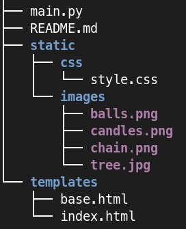

# Samostatná práce - RPG

*odhadovaný čas: ~60 min. + přečtení zadání*

Vytvoříte aplikaci postavenou na frameworku [Flask](https://flask.palletsprojects.com/).

Aplikace umožní ozdobit virtuální vánoční stromeček.

Demo aplikace najdete na [xms.asgard.odbornaskola.cz](https://xms.asgard.odbornaskola.cz).

### Není součástí hodnocení
- Použití nebo nepoužití frameworku [Bootstrap](https://getbootstrap.com/).
- Obecně vzhled nebo rozvržení (layout). 
- Stránka je rozdělená pomocí grid systému na dva sloupce v poměru 2:10. Toto není nutné dodržet, není to součástí hodnocení. 

## Součásti projektu

Na obrázku je vidět kostra aplikace:

[](./assets/xms/docs/files.png)

Obrázky lze stáhnout z tohoto repozitáře: [./assets/xms/images](./assets/xms/images/).

## Zadání

V principu jde o použití GET parametrů. Vycházejte z demo ukázky [xms.asgard.odbornaskola.cz](https://xms.asgard.odbornaskola.cz), kde např. zvolením řetězu se do URL přidá parametr `chain`:

```plain
https://xms.asgard.odbornaskola.cz/?chain=on
```

Výběrem další ozdoby, např. se přidá další parametr `balls`:

```plain
https://xms.asgard.odbornaskola.cz/?balls=on&chain=on
```

atd.

### Ovládací prvky

Jako ovládací prvek je zvolen `checkbox`. Můžete přijít i s jiným řešením.

```html
<input type="checkbox" name="candles" value="on">
```

#### Stavy

Při každém odeslání formuláře se sice parametry aktualizují v URL, ale ovládací prvky tento stav nereflektují.
Toto je třeba ošetřit v html šabloně přidáním atributu `checked`. Princip je stejný jako pro zobrazení/nezobrazení patřičného obrázku.

```html
<input type="checkbox" name="candles" value="on" checked>
```

### Zdobení stomečku

Zdobení je řešeno překrýváním obrázků. Můžete využít trik jako v demo ukázce, kde se u obrázků `img` nastavuje CSS

```css
.xmas-tree-layer {
  position: absolute;
  z-index: 10;
}
```

Důležité jsou právě vlastnosti `position` a `z-index`.

Jako úspěšné řešení bude bráno to, že se obrázek na stránce objeví (je jedno kde).
Zobrazení obrázku je podmíněno GET parametrem.


## Požadavky na implementaci

- Založte pro aplikaci repozitář na serveru Github, kam umístíte zdrojové kódy.
- Pro vytváření HTML stránek využijte koncept [dědičnosti šablon](https://jinja.palletsprojects.com/en/stable/templates/#template-inheritance). Tzn. založíte nějakou `base` šablonu a z ní se budou odvozovat šablony ostatní.
- Pro generování GET parametrů použijte HTML formulář.
- Vykreslení obrázků s ozdobami (svíčky, řetěz a koule) do HTML stránky je podmíněno přítomností GET parametrů.
- Ovládací prvky formuláře si "pamatují" stavy (zapnuto/vypnuto). Stavy reflektují aktuální URL parametry.
- Každá stránka bude validní HTML5 dokument.
